# Create Tables, Load Tables

## Introduction

This lab walks you through creating and loading NoSQL tables.   This can be done a variety of different ways including using the OCI console, writing an application program, or triggering actions via a function.  This lab will walk you through a couple of different approaches.   Oracle NoSQL Database Cloud Service supports both schema-based and schema-less (JSON) modeling so we will create examples of both tables.

Estimated Time: 25 minutes

### Objectives

* Create 3 tables with provisioned reads/sec, writes/sec, and GB storage
* Write data to the table and read data from the table
* Look at the data in the tables via the OCI console

### Prerequisites

* An Oracle Free Tier, Always Free, or Paid Cloud Account
* Connection to the Oracle NoSQL Database Cloud Service
* Working knowledge of bash shell

## Task 1: Create an Oracle NoSQL Table With the Console

1. Please verify you are in the Phoenix region.


2. On the OCI menu drop down on the left, go to Databases and then hit 'Tables' under Oracle NoSQL Database.  This brings you to the 'Table' screen where you can create a table from the console.

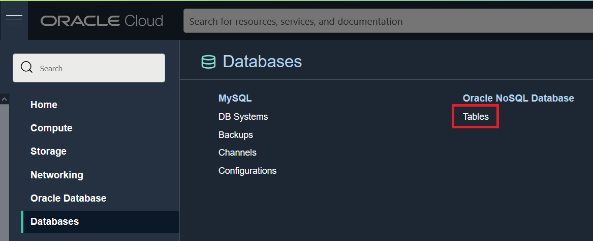

3. Click on 'Create Table' and the 'Create Table' screen appears.

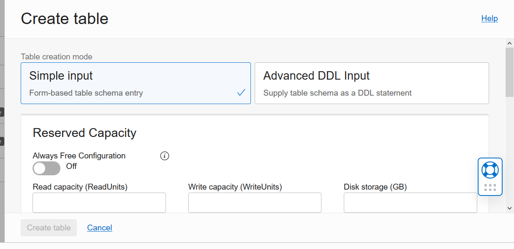

This screen allows you to create tables in one of two different ways, either using simple input or using DDL input.  For this Lab we are going to use the simple input method.  

4. The first thing you want to do is click the 'Always Free Configuration' toggle button.  This will create an always free table.   Each tenancy is allowed 3 always free tables.  Always free tables have fixed provisioning at 50 read units, 50 write units and 25 GB of storage. NoSQL always free tables are only available in the Phoenix region and you need to be in the correct region to use them.  The toggle button only shows up in the Phoenix region.

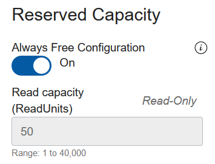

Clicking on the 'Always Free Configuration' button grays out the boxes to input provisioning.  Next enter a name for your table, a primary key and column. For this example, we used freeTest as the name, pkey with a type of integer as the primary key, and name with a type string as an additional column.  Click 'Set as a Shard Key'.

5. When done with inputs click on 'Create Table' at the bottom.

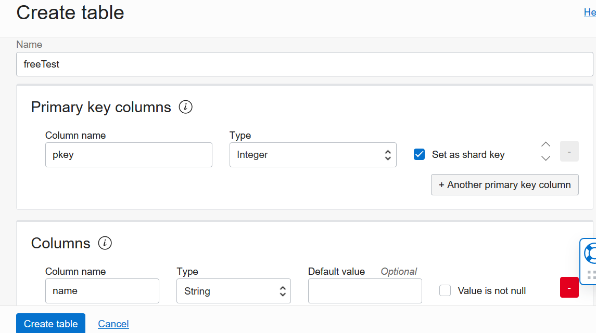

In summary, this screen allows to create a table with multiple columns for the primary key, as well as adding multiple additional columns.  You can easily create simple or more complex tables with this interface.  

6. After clicking on 'Create Table' you will be brought to the Tables screen.  This screen shows you a list of tables you have created, as well as basic information about the table.  One important thing to notice is that our table has a status of 'Active' which means we are ready to load data into our table.  Another thing to notice is the 'Always free' tag that is attached to the table.   This lets you know it is an always free table.


## Task 2: NoSQL Tables Deployment

In this task we are going to create tables using the Cloud Shell, and OCI CLI interface.   The OCI CLI commands issued from the Cloud Shell make REST calls to the Oracle NoSQL Database Cloud Service (NDCS).  OCI offers several SDKs in different languages that you can use to make REST calls to NDCS.   To make things a little simpler, we have created some shell scripts and files that will assist you in this Task.  We need to download those to the Cloud Shell first.

1. Open the Cloud Shell from the top right menu.  

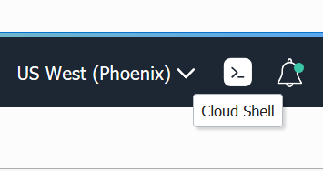


2. Execute the following environment setup shell script in the Cloud Shell. If you close/open the Cloud Shell Console, please re-execute it.

```

source ~/demo-lab-nosql/env.sh

```

3. Let's create NoSQL tables using the OCI CLI. The CLI command for Oracle NoSQl is 'oci nosql <command>'.  We will create two different tables and  echo the DDL statements so you can see what is being created.  One of the tables is a fixed schema table and the other is a JSON document table.  To create the always free table using the OCI CLI, you specify the --is-auto-reclaimable flag, as shown in the code below.

```

cd ~/demo-lab-nosql/objects
DDL_TABLE=$(cat demo.nosql)
echo $DDL_TABLE

```

```

oci nosql table create --compartment-id "$COMP_ID"   \
--name demo --ddl-statement "$DDL_TABLE" \
--is-auto-reclaimable false \
--table-limits="{\"maxReadUnits\": 50,  \"maxStorageInGBs\": 25,  \"maxWriteUnits\": 50 }" \
--wait-for-state SUCCEEDED --wait-for-state FAILED

```
```

DDL_TABLE=$(cat demoKeyVal.nosql)
echo $DDL_TABLE

```
```

oci nosql table create --compartment-id "$COMP_ID"   \
--name demoKeyVal  --ddl-statement "$DDL_TABLE" \
--is-auto-reclaimable false \
--table-limits="{\"maxReadUnits\": 50,  \"maxStorageInGBs\": 25,  \"maxWriteUnits\": 50 }" \
--wait-for-state SUCCEEDED --wait-for-state FAILED

```

4. Minimize the Cloud Shell by clicking on the minimization button.


## Task 3:  Adding Data From the OCI Console

1. Make sure you are 'Table' screen.  You should see 3 tables listed.  Your compartment should be demonosql.

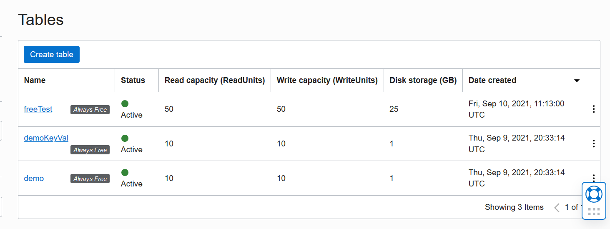

2. Lets start with the simple table we created in Task 1.  Click on freeTest table.  The screen that shows up, displays all the key information about the table.  Explore that screen.

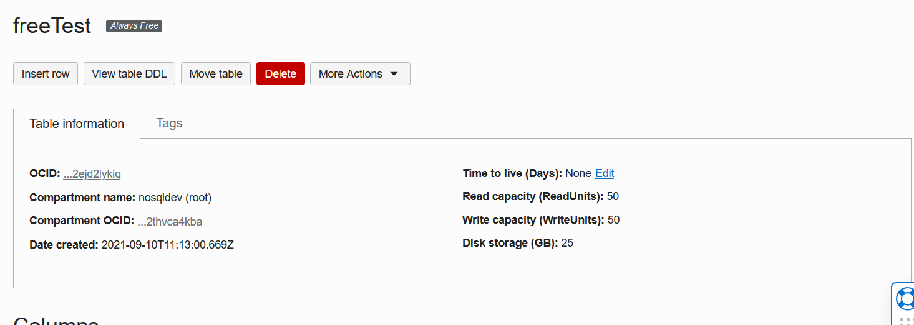

3. Click on insert row, and the insert row screen appears.


4. On the insert row screen, you will see two ways to input data - a simple and advanced.   For our freeTest table we will use the simple method.    Enter a value for the pkey column and the name column.  When done, hit 'Insert row'.

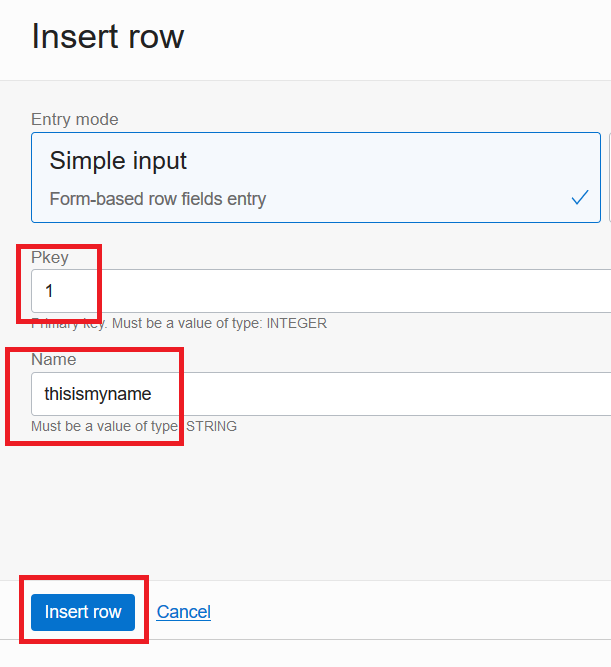

5. Let's insert rows into the other tables.  First we need to get back to the 'Tables' screen.  Click Table on top right.

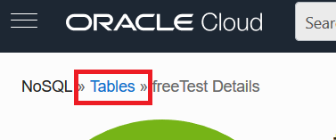

6. Click on demo table

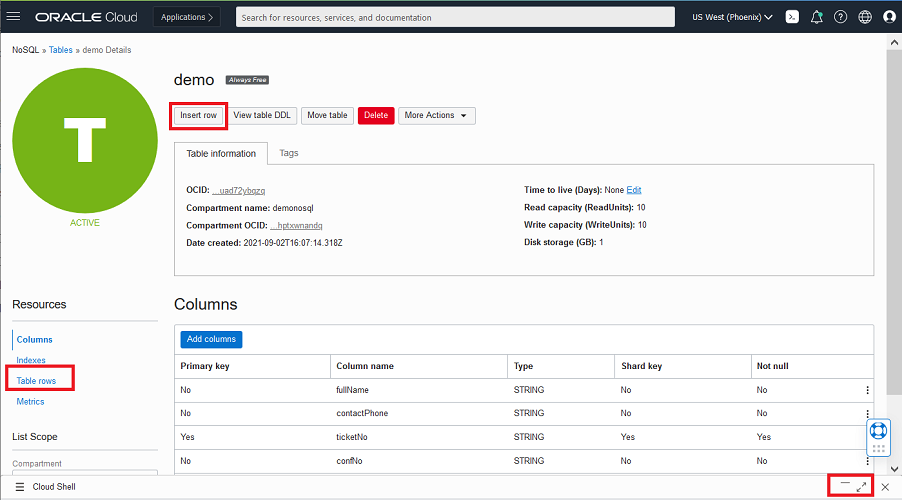

7. Click on 'Insert Row'. This opens up a new window. This time, choose Advanced Json Input.

Copy/Paste the json Baggage document below in JSON input text box.  Because this Json document is complex, it is easiest to copy/paste into the field.  However, you could have typed it all in.

````

{
  "fullName" : "Abram Falls",
  "contactPhone" : "921-284-5378",
  "ticketNo" : "176233524485",
  "confNo" : "HP1D4H",
  "gender" : "F",
  "bagInfo" : [ {
    "id" : "79039899127071",
    "tagNum" : "17657806285185",
    "routing" : "SYD/SIN/LHR",
    "lastActionCode" : "OFFLOAD",
    "lastActionDesc" : "OFFLOAD",
    "lastSeenStation" : "LHR",
    "flightLegs" : [ {
      "flightNo" : "BM254",
      "flightDate" : "2019.02.28 at 22:00:00 AEDT",
      "fltRouteSrc" : "SYD",
      "fltRouteDest" : "SIN",
      "estimatedArrival" : "2019.03.01 at 03:00:00 SGT",
      "actions" : [ {
        "actionAt" : "SYD",
        "actionCode" : "ONLOAD to SIN",
        "actionTime" : "2019.02.28 at 22:09:00 AEDT"
      }, {
        "actionAt" : "SYD",
        "actionCode" : "BagTag Scan at SYD",
        "actionTime" : "2019.02.28 at 21:51:00 AEDT"
      }, {
        "actionAt" : "SYD",
        "actionCode" : "Checkin at SYD",
        "actionTime" : "2019.02.28 at 20:06:00 AEDT"
      } ]
    }, {
      "flightNo" : "BM272",
      "flightDate" : "2019.02.28 at 19:09:00 SGT",
      "fltRouteSrc" : "SIN",
      "fltRouteDest" : "LHR",
      "estimatedArrival" : "2019.03.01 at 03:10:00 GMT",
      "actions" : [ {
        "actionAt" : "LHR",
        "actionCode" : "Offload to Carousel at LHR",
        "actionTime" : "2019.03.01 at 03:01:00 GMT"
      }, {
        "actionAt" : "SIN",
        "actionCode" : "ONLOAD to LHR",
        "actionTime" : "2019.03.01 at 11:20:00 SGT"
      }, {
        "actionAt" : "SIN",
        "actionCode" : "OFFLOAD from SIN",
        "actionTime" : "2019.03.01 at 11:10:00 SGT"
      } ]
    } ],
    "lastSeenTimeGmt" : "2019.03.01 at 03:06:00 GMT",
    "bagArrivalDate" : "2019.03.01 at 03:06:00 GMT"
  } ]
}

````


8. Click on 'Insert Row' at bottom left of screen.

To quickly summarize, in this Lab you have seen two different ways to insert data into a table.  

## Task 4:  Show Data From the Console

Starting with the demo table, we can go and look at the data we inserted for each of the tables.

1. On the left Click on Table Rows

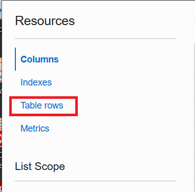

2. In the textbox Query, keep the text SELECT * FROM demo.  This will select all the rows from our table.  Click on Run query

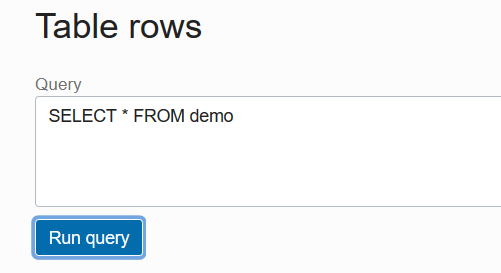

You will see in the bottom of the screen the row that we inserted.

3. Go to the top left, hit 'Tables', select the freeTest table, and look at the row inserted into that table.

You may now **proceed to the next lab.**

## Learn More

* [Oracle NoSQL Database Cloud Service page](https://www.oracle.com/database/nosql-cloud.html)
* [About Oracle NoSQL Database Cloud Service](https://docs.oracle.com/pls/topic/lookup?ctx=cloud&id=CSNSD-GUID-88373C12-018E-4628-B241-2DFCB7B16DE8)
* [About Cloud Shell](https://docs.oracle.com/en-us/iaas/Content/API/Concepts/cloudshellintro.htm)


## Acknowledgements
* **Author** - Dario Vega, Product Manager, NoSQL Product Management and Michael Brey, Director, NoSQL Product Development
* **Last Updated By/Date** - Michael Brey, Director, NoSQL Product Development, September 2021
